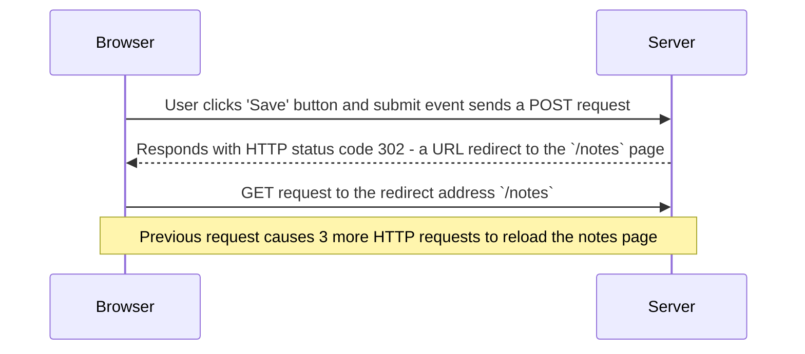
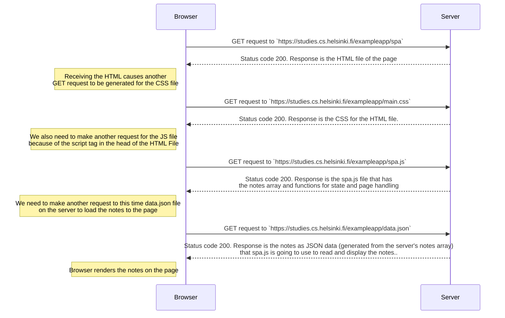
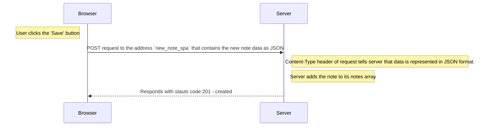

# Exercise Answers for Part 0

## Exercise 0.4 - Diagram for user creating a new note on the page

```mermaid
sequenceDiagram
    participant Browser
    participant Server
    Browser->>Server: User clicks 'Save' button and submit event sends a POST request
    Server-->>Browser: Responds with HTTP status code 302 - a URL redirect to the `/notes` page
    Browser->>Server: GET request to the redirect address `/notes`
    Note over Browser, Server: Previous request causes 3 more HTTP requests to reload the notes page
```

## Exercise 0.5 - Single page app diagram

```mermaid
sequenceDiagram
    participant Browser
    participant Server
    Browser->>Server: GET request to `https://studies.cs.helsinki.fi/exampleapp/spa`
    Server-->>Browser: Status code 200. Response is the HTML file of the page
    Note left of Browser: Receiving the HTML causes another <br/> GET request to be generated for the CSS file
    
    Browser->>Server: GET request to `https://studies.cs.helsinki.fi/exampleapp/main.css`
    Server-->>Browser: Status code 200. Response is the CSS for the HTML file.
    Note left of Browser: We also need to make another request for the JS file <br/> because of the script tag in the head of the HTML File

    Browser->>Server: GET request to `https://studies.cs.helsinki.fi/exampleapp/spa.js`
    Server-->>Browser: Status code 200. Response is the spa.js file that has <br/> the notes array and functions for state and page handling
    Note left of Browser: We need to make another request to this time data.json file <br/> on the server to load the notes to the page

    Browser->>Server: GET request to `https://studies.cs.helsinki.fi/exampleapp/data.json`
    Server-->>Browser: Status code 200. Response is the notes as JSON data (generated from the server's notes array) <br/> that spa.js is going to use to read and display the notes..
    Note left of Browser: Browser renders the notes on the page
```

## Exercise 0.6 - New note Single page app diagram

```mermaid
sequenceDiagram
    participant Browser
    participant Server
    
    Note left of Browser: User clicks the 'Save' button
    Browser->>Server: POST request to the address `new_note_spa` that contains the new note data as JSON
    
    Note right of Server: Content-Type header of request tells server that data is represented in JSON format.
    Note right of Server: Server adds the note to its notes array
    Server-->>Browser: Responds with stauts code 201 - created
```
