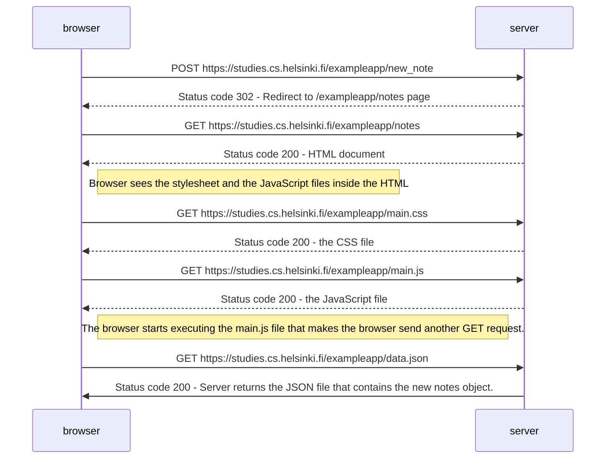
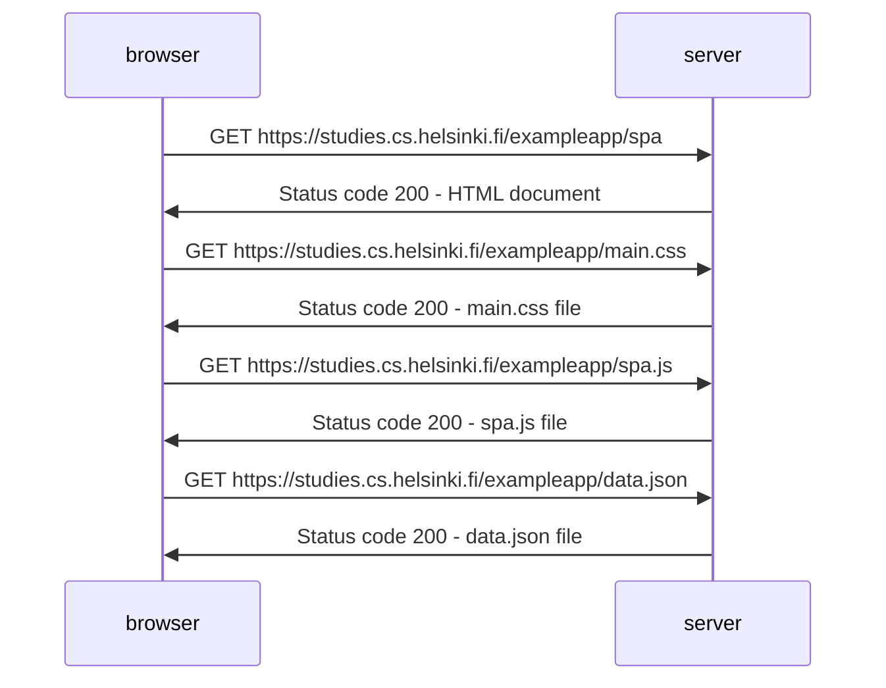
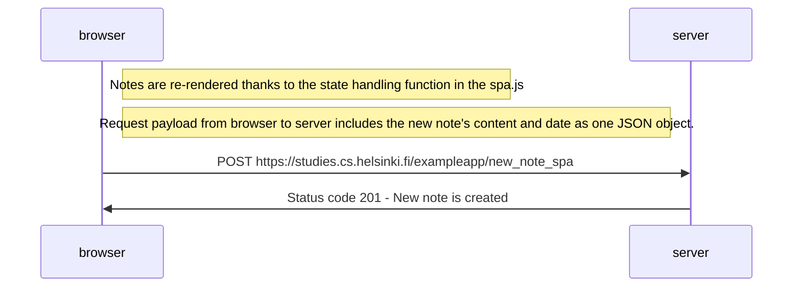

# My Submission For Exercises 0.4-0.6

## Exercise 0.4 - New Note Diagram

```mermaid
sequenceDiagram
    participant browser
    participant server

    browser->>server: POST https://studies.cs.helsinki.fi/exampleapp/new_note
    server-->>browser: Status code 302 - Redirect to /exampleapp/notes page
    
    browser->>server: GET https://studies.cs.helsinki.fi/exampleapp/notes
    server-->>browser: Status code 200 - HTML document

    Note right of browser: Browser sees the stylesheet and the JavaScript files inside the HTML
    
    browser->>server: GET https://studies.cs.helsinki.fi/exampleapp/main.css
    server-->>browser: Status code 200 - the CSS file

    browser->>server: GET https://studies.cs.helsinki.fi/exampleapp/main.js
    server-->>browser: Status code 200 - the JavaScript file

    Note right of browser: The browser starts executing the main.js file that makes the browser send another GET request.

    browser->>server: GET https://studies.cs.helsinki.fi/exampleapp/data.json
    server->>browser: Status code 200 - Server returns the JSON file that contains the new notes object.
```
## Exercise 0.5 - Single page app diagram

```mermaid
sequenceDiagram
    participant browser
    participant server

    browser->>server: GET https://studies.cs.helsinki.fi/exampleapp/spa
    server->>browser: Status code 200 - HTML document

    browser->>server: GET https://studies.cs.helsinki.fi/exampleapp/main.css
    server->>browser: Status code 200 - main.css file

    browser->>server: GET https://studies.cs.helsinki.fi/exampleapp/spa.js
    server->>browser: Status code 200 - spa.js file

    browser->>server: GET https://studies.cs.helsinki.fi/exampleapp/data.json
    server->>browser: Status code 200 - data.json file
```

## Exercise 0.6 - New note in Single page app diagram

```mermaid
sequenceDiagram
    participant browser
    participant server
    
    note right of browser: Notes are re-rendered thanks to the state handling function in the spa.js
    note right of browser: Request payload from browser to server includes the new note's content and date as one JSON object.

    browser->>server: POST https://studies.cs.helsinki.fi/exampleapp/new_note_spa
    server->>browser: Status code 201 - New note is created

```
