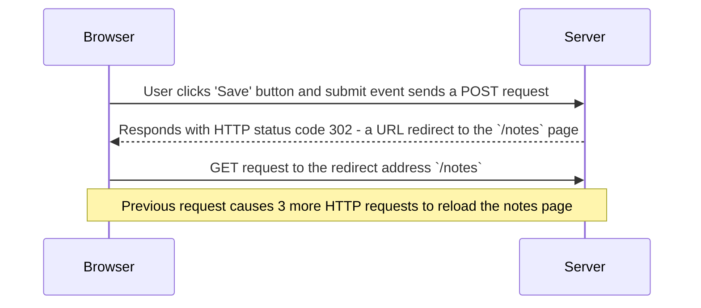

# Mermaid Example

## Exercise 0.4 - Diagram for user creating a new note on the page

```mermaid
sequenceDiagram
    participant Browser
    participant Server
    Browser->>Server: User clicks 'Save' button and submit event sends a POST request
    Server-->>Browser: Responds with HTTP status code 302 - a URL redirect to the `/notes` page
    Browser->>Server: GET request to the redirect address `/notes`
    Note over Browser, Server: Previous request causes 3 more HTTP requests to reload the notes page
```

